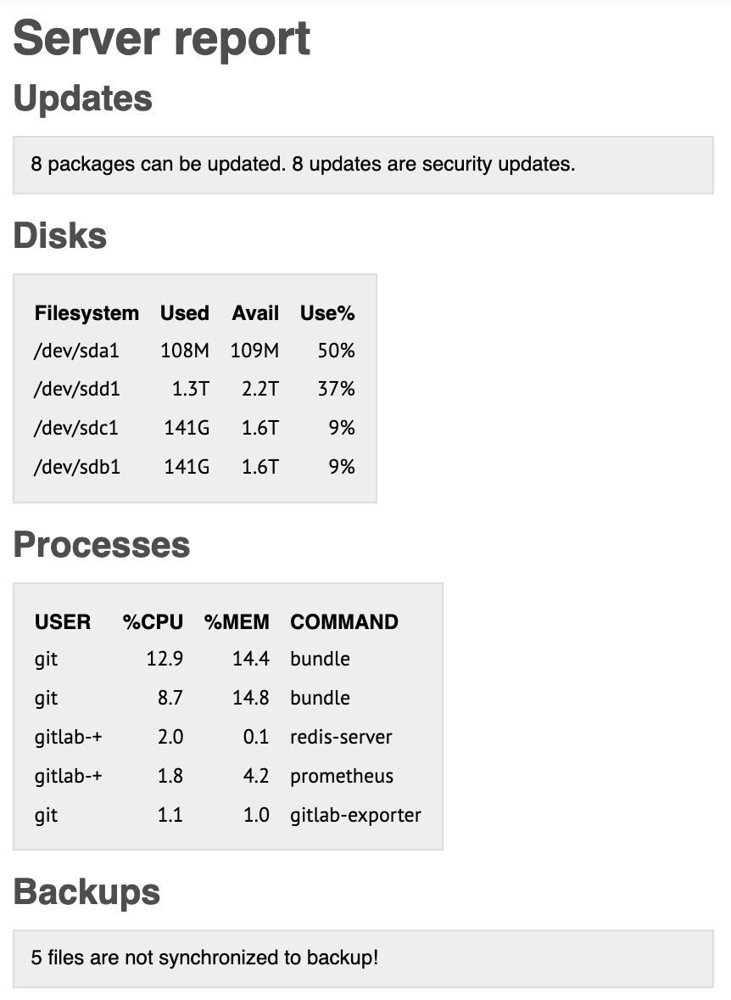

# Simple server report script

Highly configurable bash script which generates or sends nice html email with results of particular commands. Script is pluginable, so you can easily add your own sub-report. By default one report email contains:
- Backups status (just count of differences between two folders)
- Disks space
- Processess with highest load
- Available updates

## Usage
```bash
# Generates html email and sends it
./send_report.sh -o=sendmail

# Prints html report to stdout
./send_report.sh -o=html

# Prints eml message with html report to stdout
./send_report.sh -o=eml
```

## Email example


## Configuration

- See file `base_config.sh`. It contains all possible configuration variables with their default values and comments.
- Do not change values directly in `base_config.sh` file (your changes could be overwritten by update of the script).
- Instead, create file named `config.sh` in the same folder and add configuration variables which you want to overwrite.
- Plugins in `report_scripts` have their own configuration variables located at the top of each script. See **Configuration of particular plugin** paragraph.

### Example of config.sh

```bash
#!/usr/bin/env bash

EMAIL_RECIPIENT="john.doe@gmail.com"
EMAIL_RECIPIENT_NAME="John Doe"
EMAIL_SENDER="noreply@myserver"
EMAIL_SENDER_NAME="My server"
```

### Configuration of particular plugin

Some plugins have their own specific configuration. It should be located at the top of particular plugin script. Plugins are located in `./report_scripts` folder. These settings can also be overwritten by `config.sh` in the root folder.

## Writing own plugin

### Create plugin script

Lets name our plugin **"example"**. Create script `./report_scripts/example.sh` with following content:
```bash
#!/usr/bin/env bash

# All the logic should be in this function to avoid possible conflicts in variable names with main script. Also the function must have the same name as the plugin.
function example {
    local dfReport

    dfReport=$( df -h )

    echo "${dfReport}"
}
```

Add the name of the script (without the extension) to the configuration variable `REPORTS` in your `config.sh`
```bash
REPORTS=( "updates" "disks" "processes" "backups" "example" )
```
Well done. Your report is now part of the report email.